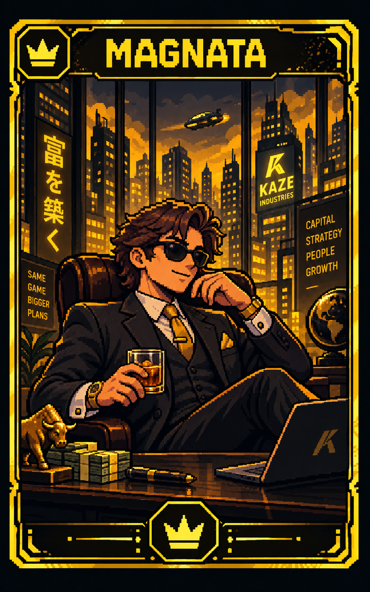
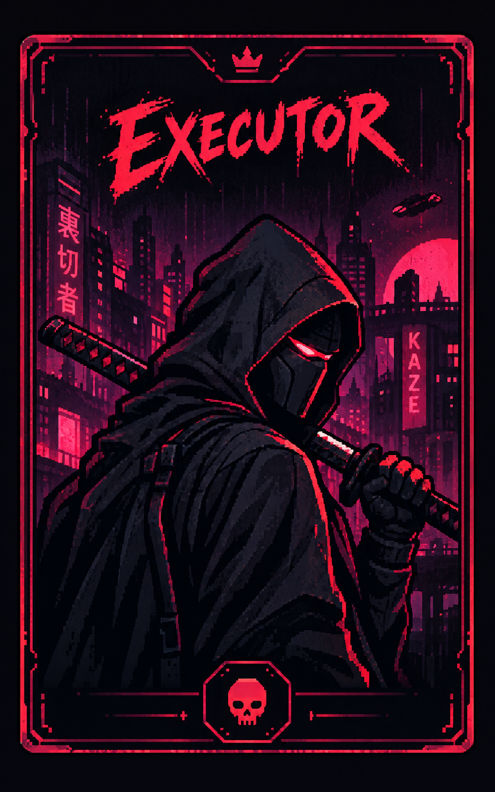
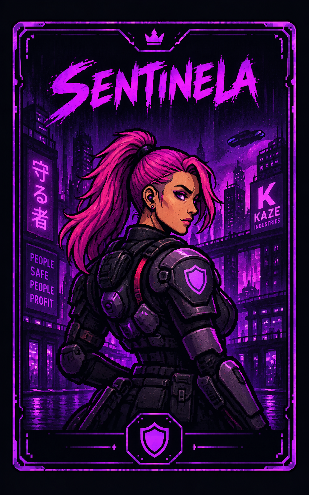
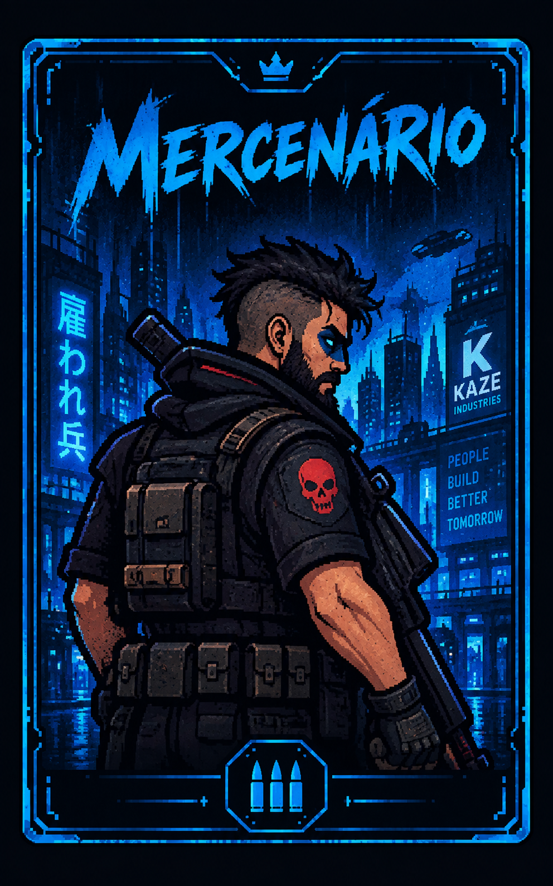
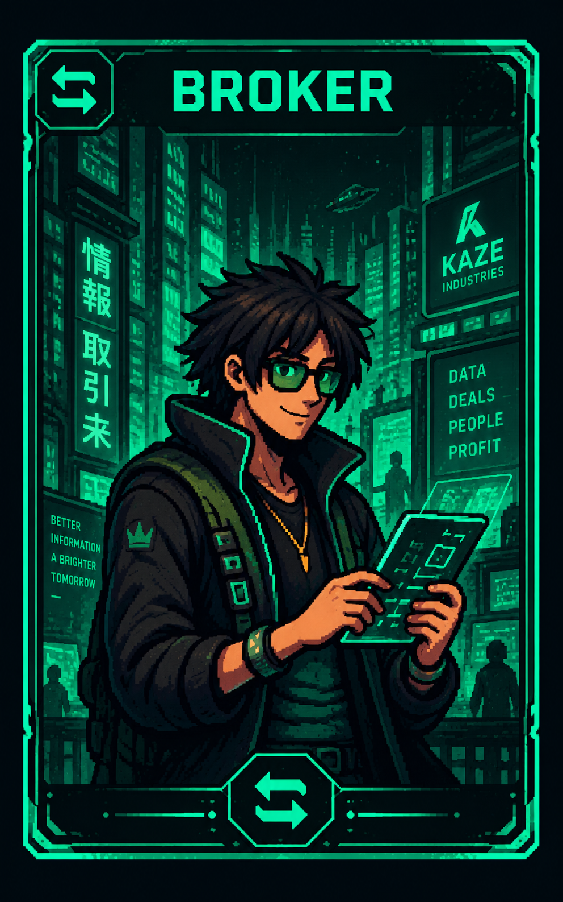

<div align="center">
  

  <p><strong>Blefe. Influência. Traição.</strong><br>Um jogo de intriga social com estética cyberpunk para jogar presencialmente em um único dispositivo.</p>

  [](https://lucamdv.github.io/Backstabber/)
  [](https://github.com/lucamdv/Backstabber/releases/latest/download/Backstabber-Windows-Setup.exe)
  [](https://github.com/lucamdv/Backstabber/releases/latest/download/Backstabber-macOS-universal.dmg)

  
  
  
</div>

---

## Entre no jogo

| Plataforma | Acesso | Observação |
| --- | --- | --- |
| 🌐 **PWA** | [Jogar ou instalar no navegador](https://lucamdv.github.io/Backstabber/) | Funciona offline depois do primeiro acesso |
| 🪟 **Windows** | [Baixar o instalador `.exe`](https://github.com/lucamdv/Backstabber/releases/latest/download/Backstabber-Windows-Setup.exe) | Abre em tela cheia e recebe atualizações automáticas |
| 🍎 **macOS** | [Baixar o instalador `.dmg`](https://github.com/lucamdv/Backstabber/releases/latest/download/Backstabber-macOS-universal.dmg) | Aplicativo universal para Apple Silicon e Intel |

> Os downloads sempre apontam para a versão mais recente publicada no GitHub Releases.

## Sobre o Backstabber

No Backstabber, cada jogador controla influências secretas e pode declarar qualquer personagem — tendo a carta ou não. Use Créditos, conteste blefes, bloqueie seus rivais e seja a última pessoa com uma influência em jogo.

- De **1 a 10 jogadores** no mesmo dispositivo.
- Baralhos proporcionais de **15, 20 ou 25 cartas**.
- Cartas: **Magnata, Executor, Sentinela, Mercenário e Broker**.
- Ações de **Patrocínio, Backstab, Taxar, Executar, Extorquir e Negociar**.
- Oráculo integrado com ações e bloqueios de cada personagem.
- Animações cinematográficas de Backstab, derrota e vitória.
- Partida salva localmente e funcionamento offline no PWA.

## Oráculo

<div align="center">
  <p>Conheça as cinco influências que comandam a mesa.</p>
</div>

| Carta | Poderes |
| :---: | --- |
| <br>**MAGNATA** | **Ação — Taxa:** recebe **3 Créditos** do tesouro.<br><br>**Bloqueia:** Patrocínio, impedindo qualquer jogador de receber 2 Créditos.<br><br>**Pode ser bloqueado por:** ninguém. |
| <br>**EXECUTOR** | **Ação — Executar:** paga **3 Créditos** para eliminar uma influência de outro jogador.<br><br>**Bloqueia:** nenhuma ação.<br><br>**Pode ser bloqueado por:** Sentinela. |
| <br>**SENTINELA** | **Ação:** não possui ação própria no turno.<br><br>**Bloqueia:** Executor, protegendo sua influência da eliminação.<br><br>**Pode ser bloqueado por:** não se aplica. |
| <br>**MERCENÁRIO** | **Ação — Extorquir:** rouba até **2 Créditos** de outro jogador.<br><br>**Bloqueia:** outro Mercenário.<br><br>**Pode ser bloqueado por:** Mercenário ou Broker. |
| <br>**BROKER** | **Ação — Negociar:** compra **2 cartas**, escolhe quais influências manter e devolve 2 ao baralho.<br><br>**Bloqueia:** Mercenário, impedindo que seus Créditos sejam roubados.<br><br>**Pode ser bloqueado por:** ninguém. |

Toda declaração de personagem pode ser contestada. Se a carta for verdadeira, ela volta ao monte, o jogador compra uma substituta aleatória e quem contestou perde uma influência. Se era blefe, quem declarou perde a influência e a ação é cancelada.

## Atualizações automáticas

O PWA verifica novas versões sem interromper uma partida em andamento. No Windows, o aplicativo baixa a atualização em segundo plano e oferece a reinicialização quando ela estiver pronta.

Cada envio à branch `main` executa o GitHub Actions para:

1. publicar o PWA no GitHub Pages;
2. gerar o instalador atualizável do Windows;
3. gerar o DMG universal para macOS;
4. publicar todos os arquivos em uma nova versão do GitHub Releases.

## macOS e Gatekeeper

Como o projeto ainda não possui um certificado Apple Developer, o macOS pode informar que o desenvolvedor não foi identificado. Se o aplicativo foi baixado deste repositório oficial, abra **Ajustes do Sistema › Privacidade e Segurança** e escolha **Abrir Mesmo Assim**.

Mais detalhes estão em [BUILD-MAC.md](BUILD-MAC.md).

## Desenvolvimento

Requer [Node.js 24 ou mais recente](https://nodejs.org/).

```bash
npm ci
npm run desktop
```

Para gerar o instalador do Windows:

```powershell
powershell -ExecutionPolicy Bypass -File .\scripts\build-windows.ps1
```

O arquivo será criado em `release/Backstabber-Windows-Setup.exe`.

---

<div align="center">
  <strong>Confie em ninguém. Principalmente em quem diz ter a carta.</strong>
</div>
